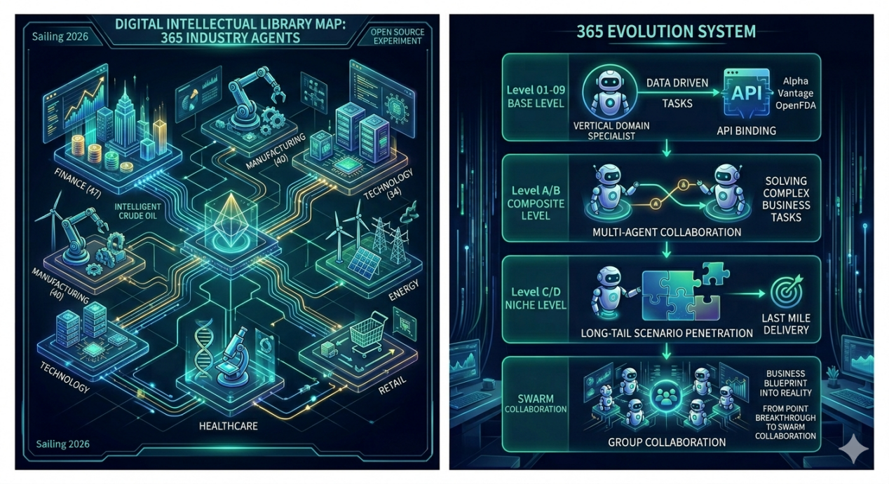
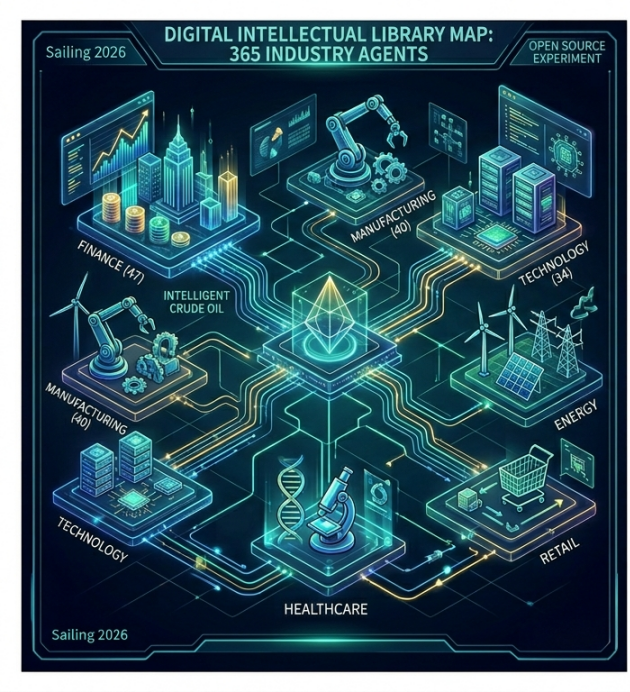
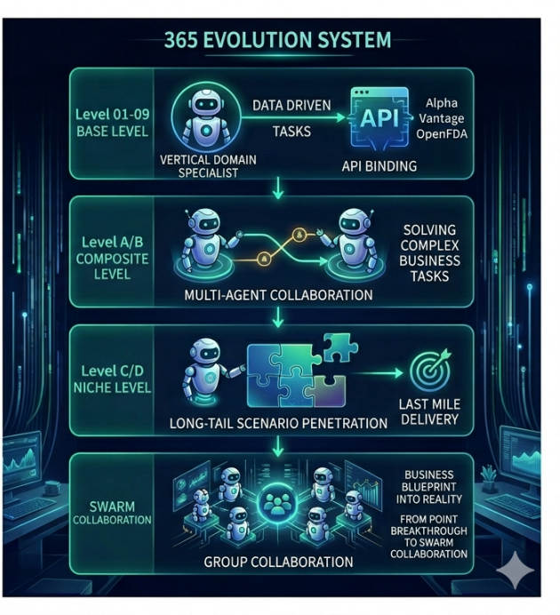
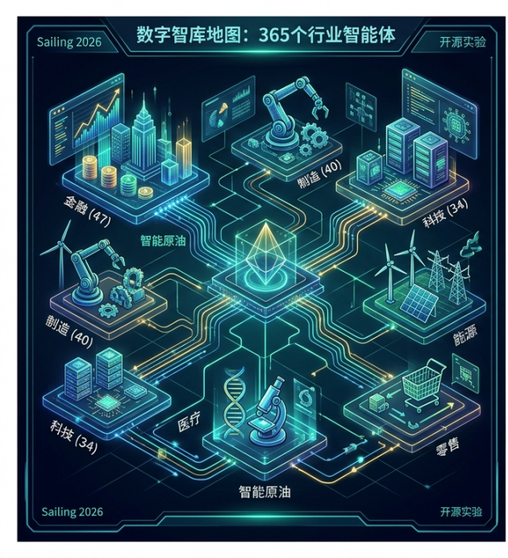

<div align="center">



<br/>
<br/>

# 🌐 Agent Square · Industry Collection

### **One year. 365 agents. Every day, a new digital employee.**

<br/>

[](#-sector-overview)
[](#-sector-overview)
[](#-quick-start)
[](#-file-format)
[](../LICENSE)

<br/>

**[🚀 Quick Start](#-quick-start)** · **[🗺️ Sectors](#-sector-overview)** · **[🧬 Evolution](#-the-365-evolution-system)** · **[📑 File Format](#-file-format)** · **[🇨🇳 中文版](#-中文版)**

</div>

---

## 💡 What is Agent Square?

> **"Digital Intellectual Library Map"** — a production-ready corpus of AI agents, one for every business scenario you'll meet this year.

Each agent is a **self-contained `.md` file** with YAML frontmatter, bound APIs, a structured workflow, and deliverable samples. Drop one into Claude Code as a subagent, paste it as a system prompt, or read it as a business blueprint. **No framework lock-in, no vendor dependency.**

<table>
<tr>
<td width="33%" align="center">
<br/>
<h3>🎯</h3>
<b>Role + Capability + Data</b>
<br/>
<sub>Every agent = a clear role, a toolkit of APIs, and a deliverable surface</sub>
<br/><br/>
</td>
<td width="33%" align="center">
<br/>
<h3>🧩</h3>
<b>Composable</b>
<br/>
<sub>Foundation agents stack into composites; composites orchestrate into swarms</sub>
<br/><br/>
</td>
<td width="33%" align="center">
<br/>
<h3>📶</h3>
<b>Simple → Complex</b>
<br/>
<sub>From a customer-service bot to full multi-agent orchestrations — every layer of complexity covered</sub>
<br/><br/>
</td>
</tr>
</table>

<br/>

## 🗺️ Sector Overview

<div align="center">



</div>

<br/>

| # | Sector | 板块 | Agents | Scene Highlights |
|:---:|:---|:---|:---:|:---|
| 01 | 🏦 **Finance** | 金融 | **47** | Stocks · Crypto · Robo-Advisor · AML · Web3 Wallet · Family Office · IPO · ABS · REITs |
| 02 | 🏭 **Manufacturing** | 制造 | **40** | Smart Factory · Digital Twin · Predictive Maintenance · Semiconductor · EMS · Shipbuilding |
| 03 | ⚡ **Energy** | 能源 | **32** | Virtual Power Plant · Hydrogen · Carbon Assets · Nuclear O&M · Offshore Wind · LNG |
| 04 | 💊 **Healthcare** | 医药 | **33** | Drug R&D · Precision Medicine · TCM AI · Gene Sequencing · Vaccine Traceability |
| 05 | 🛒 **Retail** | 零售 | **34** | Livestream Commerce · Trendy-Toy IP · Fresh Produce · Beauty Incubation · Luxury Resale |
| 07 | 🎓 **Education** | 教育 | **25** | AI Tutor · Corporate University · Career Planning · MOOC · Special Ed · Kid Coding |
| 08 | 🚚 **Logistics** | 物流 | **25** | Cold Chain · Cross-Border Brain · Smart Port · Last Mile · Hazmat · Air Cargo |
| 09 | 💻 **Technology** | 科技 | **34** | AIOps · SOC · MCP Server · XR Spatial · Low-Code · AIGC · Serverless |
| 11 | 🌾 **Agriculture** | 农牧 | **36** | Smart Farm · Digital Ranch · Agri-Futures · Swine Chain · Tea · Honey · Mushroom |
| | **Total** | | **306** | |

> 💡 **Sector 10 (General)** — the 31 horizontal / digital-employee agents (secretary, translator, HR, ESG, …) lives in the companion repo **[Ruidong-AI/agent-square](https://github.com/Cliff-AI-Lab/Ruidong-AI/tree/main/agent-square)**. Together the two repos form the complete **365 Agents — one per day of the year**.

<br/>

## 🧬 The 365 Evolution System

<div align="center">



</div>

<br/>

Inside every sector, agents evolve up four layers — from a single-capability specialist to an orchestrated business swarm:

| Tier | Prefix | Role | What it does |
|:---:|:---:|:---|:---|
| 🤖 **Base** | `01–` … `09–` | Vertical-Domain Specialist | Single capability + API binding (data-driven tasks) |
| 🔗 **Composite** | `A01–` `A02–` … | Multi-Agent Collaboration | Solves multi-step business tasks by orchestrating Agent A + Agent B + APIs |
| 🎯 **Niche** | `B01–` / `C01–` | Long-Tail Scenario Penetration | Department platforms and sub-domain concierges — the "last mile" |
| 🐝 **Swarm** | `D01–` … | Group Collaboration | Cross-role collaboration — business blueprint into reality |

**Pattern:** `data → specialist → composite → niche → swarm`. The prefix tells you where on the evolution path an agent sits.

<br/>

## 🚀 Quick Start

### 🎛️ Option 1 — Claude Code Subagent

```bash
cp "en/01-Finance/01-Stock-Analyst.md" ~/.claude/agents/stock-analyst.md
```

### 💬 Option 2 — System Prompt (any LLM)

Copy any `.md` file's content and paste it as the **system prompt** in Claude / ChatGPT / Gemini / Qwen / Kimi / DeepSeek / GLM.

### 🏗️ Option 3 — Business Blueprint Reference

Each file doubles as a **business blueprint** with APIs, workflow, and deliverables — directly usable as a reference for RPA, low-code platforms, or custom business-system design.

### 🕸️ Option 4 — Multi-Agent Orchestration

The `A/B/C/D`-series composites describe multi-agent workflows — ready-made inputs for **LangGraph**, **CrewAI**, **AutoGen**, or similar orchestration frameworks.

### 📦 Bundle Downloads

<div align="center">

[](agent-square-industries-zh.zip)

&nbsp;
[](agent-square-industries-en.zip)

</div>

<br/>

## 🔥 Sector Highlights

<details>
<summary>🏦 <b>Finance (47)</b> — banking to Web3</summary>

Stock Analyst · Crypto Advisor · Robo-Advisor · Risk & Compliance · AML · Web3 Wallet · Quant Trading · Family Office · IPO Pricing · ESG Investing · Bank Digital Human · REITs · ABS · Private Banking · Crowdfunding · Supply-Chain Finance · Cross-Border Payments
</details>

<details>
<summary>🏭 <b>Manufacturing (40)</b> — from shopfloor to supply chain</summary>

Production Efficiency Hub · Smart Factory Brain · Digital Twin · Industrial LLM · Quality Traceability · Supply-Chain Resilience · Predictive Maintenance · Auto OEM · Semiconductor Wafer · Textile Digitization · Liquor Brewing · 3D Print Cloud · Shipbuilding · Aerospace Parts · Electronics EMS
</details>

<details>
<summary>⚡ <b>Energy (32)</b> — renewables, grid, carbon</summary>

Integrated Energy Service · Virtual Power Plant · PV-Storage · Storage Arbitrage · Charging Network · Hydrogen Full-Chain · Carbon Asset Steward · Nuclear O&M · Offshore Wind · Smart Hydro · LNG Trading · EMC Savings · Geothermal · Oil & Gas Pipeline
</details>

<details>
<summary>💊 <b>Healthcare (33)</b> — from lab to bedside</summary>

Drug R&D Assistant · AI Pipeline · Hospital Ops · DTC Clinic · Real-World Evidence · Precision Medicine · TCM AI · Gene Sequencing · Medical Imaging AI · Internet Hospital · Device R&D · Vaccine Traceability · Pharmacy Chain · Orthopedic Rehab · Vision
</details>

<details>
<summary>🛒 <b>Retail (34)</b> — commerce, new and old</summary>

Omni-Channel Commerce · Livestream Commerce · New Retail Store · Smart Supply Chain · Trendy-Toy IP · Fresh Produce · Beauty Incubation · F&B Chain · Luxury Resale · Used Book · Alcohol Vertical · Flower Delivery · Outdoor · Guochao · Bridal
</details>

<details>
<summary>🎓 <b>Education (25)</b> — K-12 to lifelong</summary>

1-on-1 AI Tutor · Corporate University · Lesson Prep · Career Planning · Vocational Training · Academic Plagiarism · Multilingual Practice · Online Ed · K12 Grading · MOOC · Special Ed · Kid Coding · English Enlightenment · Civil Service Prep · Counseling
</details>

<details>
<summary>🚚 <b>Logistics (25)</b> — from port to doorstep</summary>

City Instant · Cold-Chain Full-Link · Cross-Border Brain · Smart Port · Shipping Scheduling · Last Mile · High-Value Security · Multi-Modal · Intra-City Freight · Air Cargo · Express Franchise · Hazmat · Special Transport
</details>

<details>
<summary>💻 <b>Technology (34)</b> — dev, ops, AI-native</summary>

AIOps · SOC · Data Governance · LLM App Platform · MCP Server · AI Agent Dev · XR Spatial · Game Studio · Growth Analytics · Low-Code · SaaS · AIGC · Digital Twin City · Serverless
</details>

<details>
<summary>🌾 <b>Agriculture (36)</b> — farm, forest, ocean</summary>

Smart Farm · Digital Ranch · Produce Traceability · Agri-Futures Hedging · Autonomous Farm Machinery · Swine Full-Chain · Deep-Sea Fishery · Tea Full-Chain · Rural Revitalization · Pet Ecosystem · Agri-InsurTech · Smart Forestry · Honey · TCM Herbs · Mushroom
</details>

<br/>

## 📑 File Format

Every `.md` agent follows a **YAML frontmatter + structured body** layout:

```yaml
---
name: 中文名
name_en: English Name
type: 组合应用        # optional — marks A/B/C/D composites
industry: 所属行业
apis: [API list]
emoji: 🏦
---
```

**Body sections:**

1. 🎯 **Application Scenario** — what problem it solves
2. 🛠️ **Core Capabilities / Bound APIs** — what it can do + what it plugs into
3. 🔀 **Workflow** — step-by-step operation (detailed variants included)
4. 📦 **Typical Output** — deliverable samples

## 🔌 Bound API Categories

| Domain | APIs |
|--------|------|
| 💰 **Finance** | Alpha Vantage · Finnhub · CoinGecko · ExchangeRate-API · Plaid · Etherscan |
| 🩺 **Health** | OpenFDA · ClinicalTrials.gov · PubMed · Disease.sh · NPPES · RxNorm |
| 🌍 **Environment** | OpenWeatherMap · OpenAQ · NASA EONET · Carbon Interface · Climatiq |
| 🧑‍💻 **Development** | GitHub · Stripe · HuggingFace · Replicate · VirusTotal · Shodan |
| 📦 **Logistics** | AfterShip · EasyPost · OpenRouteService · ShipEngine · 17track |
| 🌾 **Agriculture** | OpenWeatherMap Agro · NASA POWER · OpenFoodFacts · Open Prices |

> Most APIs offer free tiers — register on each vendor's site to obtain API keys.

## 🗂️ Directory Structure

```
agent-square/
├── 🇨🇳 zh/
│   ├── 01-金融/    (47)     07-教育/   (25)
│   ├── 02-制造/    (40)     08-物流/   (25)
│   ├── 03-能源/    (32)     09-科技/   (34)
│   ├── 04-医药/    (33)     11-农牧/   (36)
│   └── 05-零售/    (34)
├── 🇺🇸 en/
│   ├── 01-Finance/          07-Education/
│   ├── 02-Manufacturing/    08-Logistics/
│   ├── 03-Energy/           09-Technology/
│   ├── 04-Healthcare/       11-Agriculture/
│   └── 05-Retail/
├── 📦 agent-square-industries-zh.zip
├── 📦 agent-square-industries-en.zip
└── 📖 README.md
```

<br/>

---

<br/>

<div align="center">

## 🇨🇳 中文版


<br/>
<br/>

# 🌐 Agent 广场 · 行业智能体集

### **一年 365 天，每天一个新数字员工。**

</div>

<br/>

### 💡 这是什么？

> **"数字智库地图"** —— 一套开箱即用的 AI 智能体库，每一个都是你今年会遇到的真实业务场景。

每个智能体都是一个**独立的 `.md` 文件**，含 YAML frontmatter、绑定 API、结构化工作流、可交付物样例。可以直接塞进 Claude Code 作为子代理，可以贴到任何大模型当系统提示词，也可以当做业务蓝图阅读。**无框架绑定，无厂商锁定。**

<table>
<tr>
<td width="33%" align="center">
<br/>
<h3>🎯</h3>
<b>角色 + 能力 + 数据</b>
<br/>
<sub>每个智能体 = 清晰的角色定位 + API 工具箱 + 可交付成果</sub>
<br/><br/>
</td>
<td width="33%" align="center">
<br/>
<h3>🧩</h3>
<b>可组合</b>
<br/>
<sub>基础智能体组合成复合体，复合体编排成群体</sub>
<br/><br/>
</td>
<td width="33%" align="center">
<br/>
<h3>📶</h3>
<b>从简到繁</b>
<br/>
<sub>从单点客服机器人到多智能体复杂编排 —— 每一层复杂度都有对应方案</sub>
<br/><br/>
</td>
</tr>
</table>

<br/>

### 🗺️ 板块分布

<div align="center">



</div>

<br/>

| 序号 | 板块 | 数量 | 场景亮点 |
|:---:|:---|:---:|:---|
| 01 | 🏦 **金融** | **47** | 股票/债券/加密/保险/银行/基金/征信/ABS/NFT/家办 |
| 02 | 🏭 **制造** | **40** | 工业互联网/数字工厂/汽车/半导体/钢铁/化工/白酒/船舶 |
| 03 | ⚡ **能源** | **32** | 光伏/风电/核电/储能/氢能/碳资产/电网/水电/LNG |
| 04 | 💊 **医药** | **33** | 新药研发/基因/医院/药房/医械/月子/口腔/康复 |
| 05 | 🛒 **零售** | **34** | 电商/直播/奢侈品/母婴/酒类/户外/美业/婚嫁/潮玩 |
| 07 | 🎓 **教育** | **25** | K12/大学/留学/少儿编程/特殊教育/心理/围棋/家庭 |
| 08 | 🚚 **物流** | **25** | 城配/跨境/冷链/航空货运/港口/危化品/特种/干线 |
| 09 | 💻 **科技** | **34** | AIOps/SOC/XR/AIGC/SaaS/低代码/MCP/剪辑/Serverless |
| 11 | 🌾 **农牧** | **36** | 智慧农场/数字牧场/茶叶/水产/林业/蜂蜜/中药材/食用菌 |
| | **合计** | **306** | |

> 💡 **板块 10（通用）** —— 31 个水平向数字员工（秘书、翻译、HR、ESG 等）发布在姐妹仓库 **[Ruidong-AI/agent-square](https://github.com/Cliff-AI-Lab/Ruidong-AI/tree/main/agent-square)**。两仓合计 **365 个智能体，一年每天一个**。

<br/>

### 🧬 365 进化系统

<div align="center">


</div>

<br/>

每个板块内的智能体沿四层进化路径展开：从单一能力专家一路演化到跨角色业务群：

| 层级 | 前缀 | 角色 | 职能 |
|:---:|:---:|:---|:---|
| 🤖 **基础层** | `01–` … `09–` | 垂直领域专家 | 单一能力 + API 绑定（数据驱动任务） |
| 🔗 **复合层** | `A01–` `A02–` … | 多 Agent 协作 | Agent A + Agent B + API 联动，解决多步业务任务 |
| 🎯 **小众层** | `B01–` / `C01–` | 长尾场景渗透 | 部门级平台 + 子领域管家 —— "最后一里" |
| 🐝 **群体层** | `D01–` … | 群体协作 | 跨角色协作 —— 业务蓝图落入真实 |

**规律：** `数据 → 专家 → 复合 → 小众 → 群体`。前缀即进化阶位。

<br/>

### 🚀 四种用法

1. **🎛️ Claude Code 子代理**：`cp "zh/01-金融/01-股票分析师.md" ~/.claude/agents/stock-analyst.md`
2. **💬 系统提示词**：复制 md 内容贴到 Claude / ChatGPT / Gemini / Qwen / Kimi / DeepSeek / GLM 的系统提示词位置
3. **🏗️ 产品/架构参考**：每个文件都是带 API、工作流、交付物的业务蓝图，可直接用于 RPA、低代码或业务系统设计
4. **🕸️ 多 Agent 编排**：`A/B/C/D` 系列描述多 Agent 协作场景，可作为 LangGraph / CrewAI / AutoGen 的编排输入

### 📦 整包下载

<div align="center">

[](agent-square-industries-zh.zip)
&nbsp;
[](agent-square-industries-en.zip)

</div>

<br/>

### 📅 玩法建议

- **按月排** —— 1 月金融月、2 月制造月、3 月能源月……
- **按需查** —— 遇到业务场景直接搜
- **按天学** —— 每天 15 分钟看一个，积累行业思维模型

<br/>

---

<br/>

<div align="center">

### 🌟 Explore More · 探索更多

<a href="https://iruidong.com/"></a>
&nbsp;
<a href="https://github.com/Cliff-AI-Lab/Ruidong-AI"></a>
&nbsp;
<a href="https://github.com/Cliff-AI-Lab/Ruidong-AI/tree/main/agent-square"></a>
&nbsp;
<a href="https://x.com/RaytoneAI"></a>

<br/>
<br/>

<sub>

*From laboratory exploration in AI for Science to real-world productivity in AI for Scenes.*

*每一个智能体都是一个可落地的业务锚点 —— 一年 365 天，不重样。*

</sub>

<br/>

Copyright &copy; 2026 Cliff AI Lab. All rights reserved.

</div>
