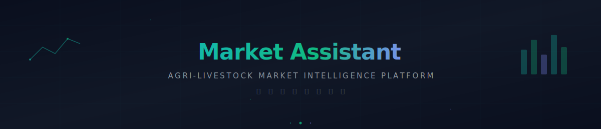

<p align="center">
  
</p>

<p align="center">
  
  
  
  
</p>

<p align="center">
  <b>Agri-Livestock Market Intelligence Platform</b><br/>
  <sub>AI-powered commodity price forecasting, procurement decision support, and market analytics for the agriculture and livestock industry.</sub>
</p>

<p align="center">
  <a href="#features">Features</a> · 
  <a href="#quick-start">Quick Start</a> · 
  <a href="#modules">Modules</a> · 
  <a href="#tech-stack">Tech Stack</a> · 
  <a href="#configuration">Configuration</a>
</p>


## Features

### Dashboard Overview

Real-time monitoring of 5 key agri-livestock commodities with AI-driven insights:

| Commodity | Chinese | Key Drivers |
|-----------|---------|-------------|
| **Soybean Meal** | 豆粕 | Brazil port congestion, CBOT futures, USD/CNY |
| **Corn** | 玉米 | Planting area, weather forecasts, feed demand |
| **Rapeseed Meal** | 菜粕 | Canada rapeseed output, substitution spread |
| **Fishmeal** | 鱼粉 | Peru anchovy quota, fishing season, imports |
| **Soybean Oil** | 豆油 | Palm oil spread, biodiesel policy, crush margin |

### Core Capabilities

- **Three-Line Forecast Chart** — Actual price, model forecast, and procurement guideline on a single timeline with 80%/95% confidence intervals
- **AI-Powered Analysis** — Natural language market insights via iRuidong AI platform (DeepSeek V3.1)
- **Deviation Detection** — Automatic identification of forecast-vs-actual deviations with root cause analysis
- **Procurement Decision Engine** — Buy/hold/wait recommendations with ideal entry prices and stop-loss levels
- **Inventory Monitoring** — Stock days tracking with automatic replenishment alerts
- **Agent Management** — Monitor data collection, analysis, and alert agents in real-time
- **Dark/Light Theme** — Dual-theme design system (Midnight Teal / Daylight)


## Quick Start

### Prerequisites

- Node.js 20+

### Install & Run

```bash
cd agri-livestock/market-assistant

# Install dependencies
npm install

# Start dev server
npm run dev
```

> Open **http://localhost:5173** to access the platform.

### AI Chat (Optional)

To enable the AI chat panel, configure the iRuidong API key:

```bash
cp .env.example .env
# Edit .env and set VITE_IRUIDONG_API_KEY=sk-your-key
```

The platform works fully without the API key — AI chat will show a placeholder instead.


## Modules

| Module | Description |
|--------|-------------|
| **Overview Dashboard** | 5-commodity cards with sparklines, agent status, data quality, inventory alerts |
| **Data Management** | Data source connectivity, quality metrics, collection schedules |
| **Model Management** | ML model performance tracking, accuracy metrics, retraining history |
| **Agent Management** | AI agent lifecycle — data collectors, analyzers, alert dispatchers |
| **App Integration** | WeChat Work, DingTalk, Feishu webhook configuration |
| **Market Analysis** | Deep-dive commodity analysis with three-line charts, drivers, deviations |


## Tech Stack

| Technology | Purpose |
|-----------|---------|
| **React 19** | UI framework with latest concurrent features |
| **TypeScript 6** | Type safety across the entire codebase |
| **Tailwind CSS v4** | Utility-first styling with CSS-native engine |
| **ECharts 6** | High-performance charting (sparklines, time series, donuts) |
| **Framer Motion** | Fluid page transitions and micro-animations |
| **Lucide React** | Consistent iconography |
| **Vite 8** | Lightning-fast dev server and build |
| **iRuidong API** | OpenAI-compatible LLM integration (DeepSeek V3.1) |


## Configuration

| Variable | Description | Default |
|----------|-------------|---------|
| `VITE_IRUIDONG_API_KEY` | iRuidong AI platform API key for chat | — |

> The AI platform endpoint (`https://iruidong.com/v1`) is OpenAI-compatible. You can replace it with any OpenAI-compatible API provider.


## Project Structure

```
market-assistant/
├── public/               # Static assets (favicon, icons)
├── src/
│   ├── components/
│   │   ├── ai/           # AI chat panel
│   │   ├── cards/        # Metric, driver, model health cards
│   │   ├── charts/       # Three-line forecast chart (ECharts)
│   │   ├── deviation/    # Deviation detection & manual supplement
│   │   ├── layout/       # Header, sidebar
│   │   ├── pages/        # 6 main pages
│   │   ├── procurement/  # Procurement decision panel
│   │   └── shared/       # Reusable UI components
│   ├── context/          # App state (commodity, period, theme)
│   ├── data/             # Mock data generators
│   └── lib/              # iRuidong API client, utilities
├── index.html
├── package.json
└── vite.config.ts
```


## License

[MIT](LICENSE)


<p align="center">
  <sub>行 情 分 析 智 能 助 手 &nbsp;·&nbsp; Market Assistant</sub><br/>
  <sub>Part of <a href="https://github.com/Cliff-AI-Lab/Enterprise-AI-Lab">Enterprise AI Lab</a> — Agri-Livestock Sector</sub>
</p>

<p align="center">
  <a href="https://github.com/Cliff-AI-Lab/Ruidong-AI"></a>
  &nbsp;
  <a href="https://x.com/RaytoneAI"></a>
</p>
