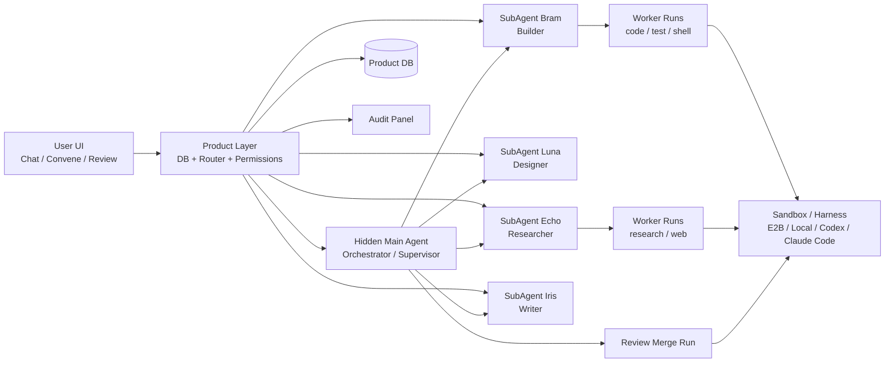
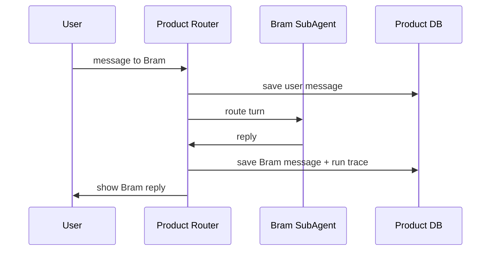
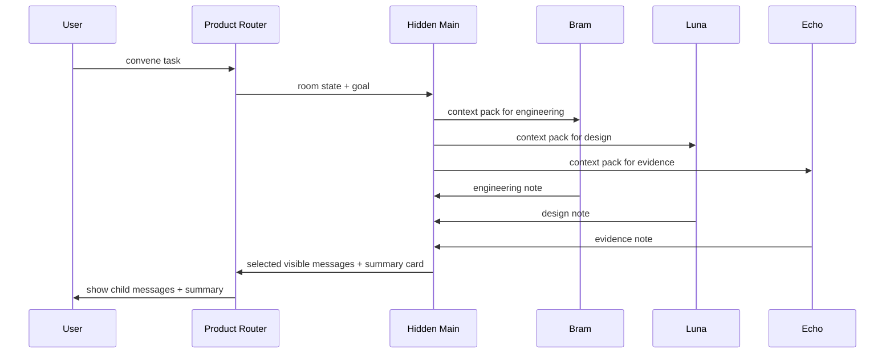
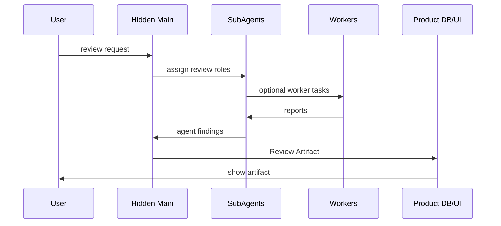

> ⚠️ **[STALE — 2026-05-29]** 这是基于 "Main spawn Bram/Nova/Atlas/Iris" 的早期 GPT 设计，第 9 轮已被原生 multi-agent 模型推翻（visible subagent = OpenClaw `agents.list[]` 各一项）。**当前实现快照看 [`00_README.md`](00_README.md)** / [`../CLAUDE.md`](../CLAUDE.md)；历史决策链见 [`../temp_design.md`](../temp_design.md)。

---

# 总体架构

## 架构目标

做一个 Telegram/Slack 风格的 AI 小人协作产品：用户可以单聊每个小人，也可以随时拉群协作；隐藏 Main Agent 在后台管理上下文、调度、权限、审计和进化。

## 总体图



## 层级定义

### 1. UI Layer

用户看到：

```text
左侧：chats / groups / contacts
顶部：Chat / Convene / Review
中间：小人消息
右侧 ...：审计/后台工作
```

UI 不展示 Main Agent。

### 2. Product Layer

产品层是主权层，负责：

```text
用户身份
小人身份
房间和成员
消息存档
权限
状态
artifact
审计事件
进化 patch
runtime adapter
```

### 3. Hidden Main Agent

隐藏主控，负责：

```text
群聊调度
Review 编排
context pack 构造
跨 SubAgent 信息传递
终止循环
生成 summary card
后台反思和进化
错误恢复
```

不负责：

```text
日常单聊每条消息都介入
以人格身份回复用户
绕过权限读取所有私聊
无限制修改 SubAgent 配置
```

### 4. SubAgent Layer

用户可见小人。

每个 SubAgent 有：

```text
name / avatar / role
soul / persona
memory
workspace
skills
tools
model
permissions
status
```

### 5. Worker Run Layer

后台临时任务。例如：

```text
搜索资料
跑测试
读 repo
生成 diff
并行探索方案
代码 review 子任务
```

Worker Run 默认不作为聊天对象出现。

### 6. Runtime/Harness Layer

第一版优先 OpenClaw。之后可接：

```text
Codex
Claude Code
Hermes Agent
Gemini CLI
E2B / Daytona / Modal
自研 sandbox
```

必须通过 adapter 接入。

## 核心数据流

### 单聊



### 群聊 Convene



### Review



## 架构底线

1. Main Agent 是系统操作员，不是用户聊天对象。
2. SubAgent 是产品身份，不绑定某个 runId。
3. Product DB 保存用户可见事实。
4. Runtime 只负责执行和 session 管理。
5. 审计可展开，但默认不污染聊天。
