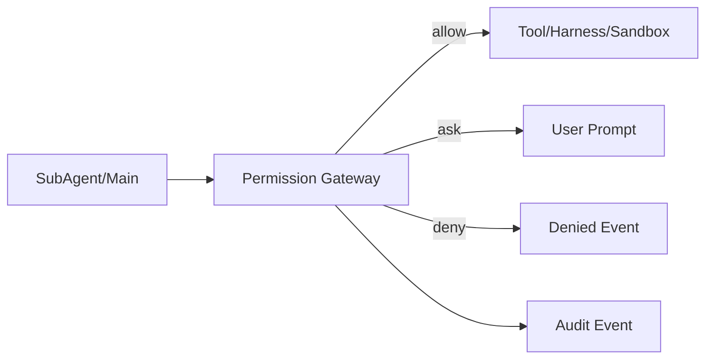

> ⚠️ **[STALE — 2026-05-29]** 这是基于 "Main spawn Bram/Nova/Atlas/Iris" 的早期 GPT 设计，第 9 轮已被原生 multi-agent 模型推翻（visible subagent = OpenClaw `agents.list[]` 各一项）。**当前实现快照看 [`00_README.md`](00_README.md)** / [`../CLAUDE.md`](../CLAUDE.md)；历史决策链见 [`../temp_design.md`](../temp_design.md)。

---

# 安全、权限与审计

## 安全目标

1. 用户知道哪个小人做了什么。
2. Main Agent 不能默认越权读取私聊或文件。
3. 高风险操作必须审批。
4. 审计可展开，但不污染主聊天体验。
5. 不泄露私密推理、凭证、系统 prompt。

## 权限边界

### 低风险，可自动

```text
读取当前 room public messages
读取目标 SubAgent 自己的 memory summary
生成普通回复
生成 Summary Card
写低风险 memory note
```

### 中风险，通常要询问或受策略限制

```text
读取项目文件
把私聊摘要分享到群里
调用外部 web/search
运行长任务 worker
修改 SubAgent soul/skills/model
```

### 高风险，必须审批

```text
写文件
执行 shell
访问凭证/API key
改权限策略
改 harness/runtime 代码
读取其他 SubAgent 的私聊 raw transcript
跨 workspace 读写
```

## Permission Gateway

所有工具操作都应该经过产品层权限网关。



## Permission Prompt 格式

```text
谁：Bram
想做什么：读取 repo 文件
范围：/apps/web/src/**
原因：代码 review
风险：中
有效期：本次 review run
选项：[允许一次] [允许本房间] [拒绝]
```

## Context 权限

Main Agent 不是自动拥有全部私聊内容。

默认策略：

```text
DM raw transcript: private
Room public messages: room visible
Artifacts: by visibility
Memory: scoped
Handoff: explicit
```

跨 SubAgent 传递时优先传：

```text
finding
summary
artifact
question
constraint
```

避免传：

```text
完整 raw transcript
未授权 DM
未脱敏文件内容
凭证/secret
```

## 审计面板内容

右侧 `...` 应该显示：

```text
Route Decision
- 为什么选 Bram/Luna/Echo
- 为什么没选 Iris

Context Pack
- 给每个 SubAgent 的摘要
- 隐藏/剔除的内容及原因

Runs
- SubAgent turn
- Worker run
- Review merge

Tool Calls
- 工具名
- 参数摘要
- 结果摘要
- 是否经过审批

Permission Events
- 谁请求
- 请求范围
- 用户决定

Artifacts
- 输出文件/summary/review/diff

Cost / Latency
- token/cost/time

Errors
- 失败、重试、降级
```

## 审计面板禁止展示

```text
完整 chain-of-thought
系统 prompt 全文
凭证明文
未授权私聊 raw transcript
安全策略绕过细节
```

## TraceEvent

```ts
type TraceEvent = {
  id: string
  runId: string
  eventType:
    | 'route_decision'
    | 'context_pack_created'
    | 'subagent_called'
    | 'worker_spawned'
    | 'tool_requested'
    | 'permission_requested'
    | 'permission_resolved'
    | 'artifact_created'
    | 'run_cancelled'
    | 'error'
  publicSummary: string
  redactedPayloadRef?: string
  createdAt: string
}
```

## 外部 Harness 风险

Codex、Claude Code、Gemini CLI、ACP、local shell 等外部 harness 可能不受 OpenClaw 的 sandbox 完全约束。

因此必须加：

```text
cwd jail
repo scope
read/write allowlist
network allowlist
secret injection policy
per-run env
approval gate
log capture
kill switch
```

## Kill Switch

必须支持：

```text
取消单个 run
取消某个 SubAgent 当前任务
暂停某个 room 的所有 worker
禁用某个工具
禁用某个 SubAgent
关闭 Main Agent 的后台进化
```

## 默认安全策略

MVP 默认：

```text
DM privacy: strict
shell exec: ask + sandbox required
file write: ask
credential access: ask
private context sharing: ask
agent config mutation: approval required
worker timeout: required
max group rounds: 2
```
