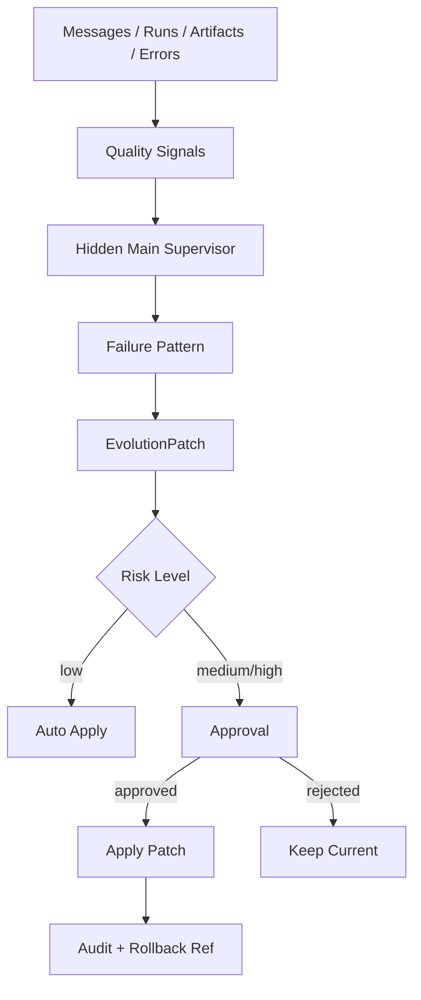

> ⚠️ **[STALE — 2026-05-29]** 这是基于 "Main spawn Bram/Nova/Atlas/Iris" 的早期 GPT 设计，第 9 轮已被原生 multi-agent 模型推翻（visible subagent = OpenClaw `agents.list[]` 各一项）。**当前实现快照看 [`00_README.md`](00_README.md)** / [`../CLAUDE.md`](../CLAUDE.md)；历史决策链见 [`../temp_design.md`](../temp_design.md)。

---

# SubAgent 进化机制

## 核心思想

不是让每个 SubAgent 完全自我进化，而是让隐藏 Main Agent 以“上帝视角”观察多个 SubAgent 的表现，发现失败模式，生成可审计、可回滚的 EvolutionPatch。

## 为什么 Main Agent 更适合做进化监督

单个 SubAgent 只能看到自己的局部会话，而 Main Agent 可以看到：

```text
多个 SubAgent 的表现差异
同一任务里谁更稳定
群聊中谁重复/跑偏
哪些 skills 有用
哪些工具经常失败
用户在哪些地方打断/纠正
review 产物质量是否提高
```

## Evolution Loop



## Quality Signals

可用信号：

```text
用户 thumbs up/down
用户手动改写
用户要求“重来”
SubAgent 自己承认不确定
tool failure
review 后被证明错误
重复发言
超时
成本过高
另一个 SubAgent 指出错误
用户选择了哪个建议
```

## Patch 类型

```text
memory_update       更新长期记忆
style_update        调整表达风格
skill_update        新增/修改 checklist 或技能
soul_update         修改人格边界
model_update        切换默认模型
tool_update         新增/限制工具
permission_update   修改权限策略
runtime_update      修改 harness/代码
```

## 风险分级

### Low Risk：可自动应用

```text
memory note
style preference
known failure note
room summary
project fact with high confidence
```

### Medium Risk：需要审批或灰度

```text
skill checklist
prompt/soul 小改
默认输出格式改变
模型切换
新增低风险工具
```

### High Risk：必须审批

```text
工具权限扩大
文件/凭证权限变化
shell 执行策略
runtime/harness 代码修改
跨 Agent 私聊访问策略
```

## EvolutionPatch 格式

```ts
type EvolutionPatch = {
  id: string
  targetAgentInstanceId: string
  patchType: 'memory' | 'style' | 'skill' | 'soul' | 'model' | 'tool' | 'permission' | 'runtime_code'
  reason: string
  evidenceRefs: string[]
  proposedDiff: string
  expectedImpact: string
  riskLevel: 'low' | 'medium' | 'high'
  approvalStatus: 'auto_applied' | 'pending' | 'approved' | 'rejected' | 'rolled_back'
  rollbackPlan: string
}
```

## 示例

```markdown
# Evolution Patch

target: Bram
patch_type: skill_update
risk: medium
approval: pending

## Evidence
最近 5 次代码 review 中，Bram 给出了实现建议，但没有明确区分 must-fix 和 nice-to-have。用户其中 3 次追问“哪些必须改”。

## Proposed Diff
新增 `skills/review_priority_checklist.md`：
- 每次 review 必须输出 Must Fix / Should Fix / Optional
- 每个 Must Fix 必须说明风险等级和不改的后果

修改 `AGENTS.md`：
- 在 code review 回复前运行 priority checklist

## Expected Impact
减少用户追问，提高 review 可执行性。

## Rollback
删除新增 checklist，并恢复 AGENTS.md 上一版。
```

## 进化频率

MVP 推荐：

```text
memory update: 每次会话后轻量判断
room summary: 每个 room 结束或 idle 后
failure pattern scan: 每天一次
skill/soul patch: 每周或显著失败后
permission/tool patch: 手动触发或管理员审批
```

## 禁止项

不要让 Main Agent：

```text
静默扩大工具权限
静默读取更多私聊
静默修改 runtime 代码
静默把一个 SubAgent 变成另一个人格
因为一次失败就大幅改 soul
无 rollback 地改配置
```
